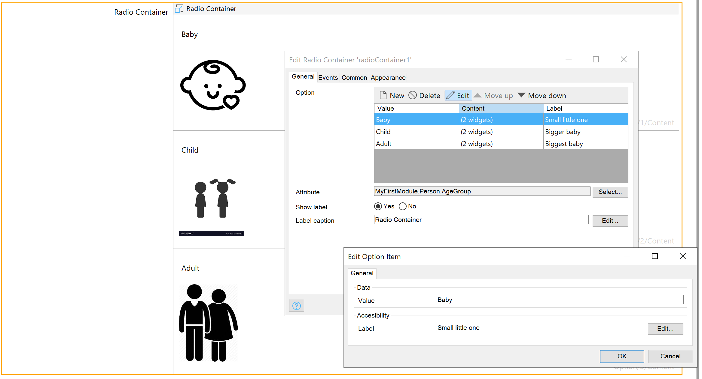
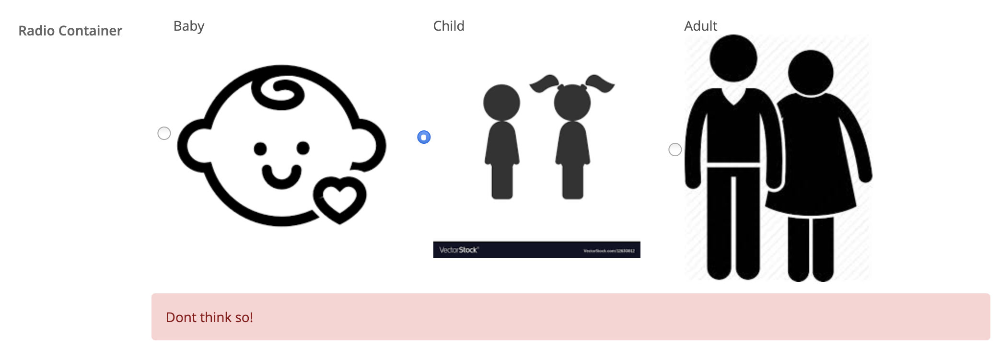

## Radio Container

**Warning: This prototype is for demonstration purposes only. And is not an official Mendix product with support.**

### Use case
Create a screen reader accessible static Radio with a flexible containers options.

### Usage
 - place the widget in the form
 - Select an `Attribute` of type enumeration
 - Create options with the value matching the numeration
 - Model in the each option container a representation of the option.
 - Configure a label if needed.
 - Validation feedback on the `Attribute` via nanoflow or microwflow will be rendered.

